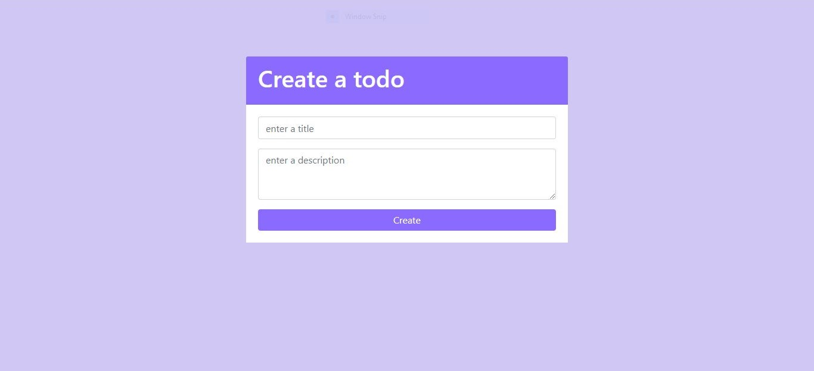

# Todo App
A simple todo app made with laravel.

## Screenshots
 
 
 
 

## Tools & Languages
 - [Bootstrap 4.4](https://getbootstrap.com/)
 - [fontawesome](https://fontawesome.com/)
 - [Laravel](https://laravel.com/)
 - [vscode](https://code.visualstudio.com/)

Laravel is accessible, powerful, and provides tools required for large, robust applications.
## Contributing
Pull requests are welcome. Feel free to fork this repo.

## License

This project is licensed under the [MIT license](https://opensource.org/licenses/MIT).
